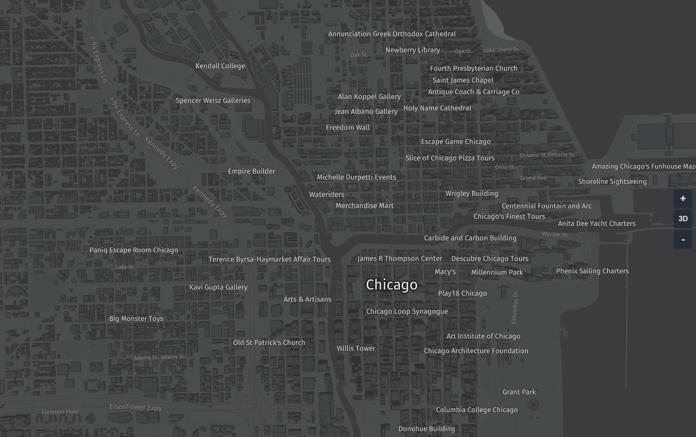
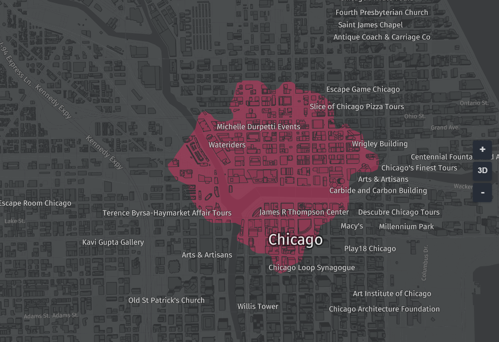
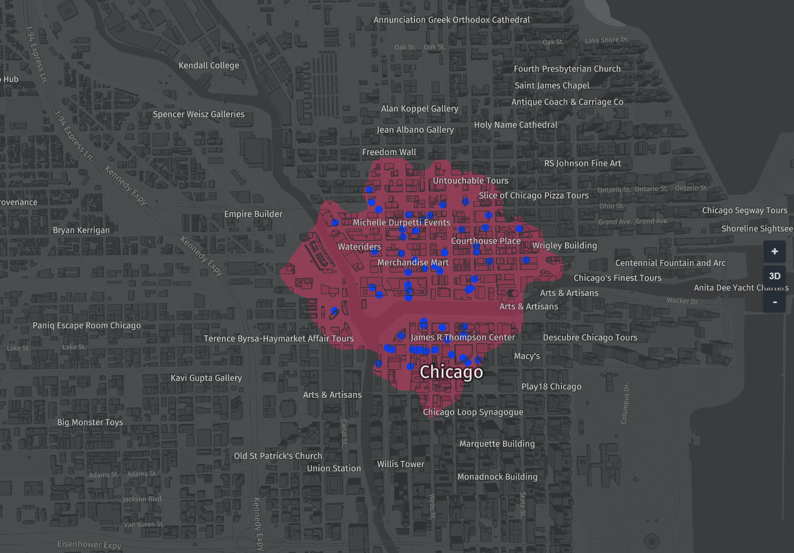

# Isoline routing using HLS and harp.gl

This tutorial combines the harp.gl with HERE's Isoline router which define all reachable area within a certain time and transportation mode.

harp.gl is a beta product and we are always looking to improve it with your feedback. For any comments,
 suggestions, or bug reports, we encourage you to create an issue on the harp.gl GitHub repository

### Become a HERE Developer

Navigate to [developer.here.com](developer.here.com)  and click Get started for free in the top right.
Create an account. No credit card is required. You will need two types of tokens one for harp.gl and one to access HERE's developer REST services.

#### harp.gl token
Once you've created a HERE Developer account, navigate to the to [HERE XYZ Token Manager](https://xyz.api.here.com/token-ui/).
Sign in with the HERE account you just created.

You'll want to generate a new token. Select the checkbox under READ DATA and then click Generate Token

#### HERE REST API's

You need to also create a REST App credentials. Create a Freemium project at [developer.here.com](https://developer.here.com/sign-up?create=Freemium-Basic&keepState=true&step=terms) and select Generate App ID and App Code

### Method 1 Linking a single script bundle to your html (recommended)

In your command line, create a new directory and navigate into it:
```
mkdir harp.gl-tutorial
cd harp.gl-tutorial
```
Create two files: index.html and index.js:
```
touch index.js
touch index.html
```
Copy and paste the following code into each of the files.

index.html
```html
<html>
   <head>
      <style>
         body, html { border: 0; margin: 0; padding: 0}
         #map { height: 100vh; width: 100vw; }
      </style>
      <script src="https://unpkg.com/three/build/three.min.js"></script>
      <script src="https://unpkg.com/@here/harp.gl/dist/harp.js"></script>
      <script src="https://npmcdn.com/@turf/turf/turf.min.js"></script>
   </head>
   <body>
      <canvas id="map"></canvas>
      <script src="index.js"></script>
   </body>
</html>
```
```javascript
const canvas = document.getElementById('map');
const map = new harp.MapView({
   canvas,
   theme: "https://unpkg.com/@here/harp-map-theme@latest/resources/berlin_tilezen_night_reduced.json",
   //For tile cache optimization:
   maxVisibleDataSourceTiles: 40,
   tileCacheSize: 100
});

// HERE REST Credentials

const APP_ID = "YOUR_APPID";
const APP_CODE = "YOUR_APP_CODE";

// Setting the center will use this for both isoline and Places
// in this case we will choose Chicago, IL, USA
let center = new harp.GeoCoordinates(41.8889103,-87.6365736);
map.setCameraGeolocationAndZoom(
   center,
   15
);

const mapControls = new harp.MapControls(map);
const ui = new harp.MapControlsUI(mapControls);
canvas.parentElement.appendChild(ui.domElement);

mapControls.maxPitchAngle = 75;
map.resize(window.innerWidth, window.innerHeight);
window.onresize = () => map.resize(window.innerWidth, window.innerHeight);

const omvDataSource = new harp.OmvDataSource({
   baseUrl: "https://xyz.api.here.com/tiles/herebase.02",
   apiFormat: harp.APIFormat.XYZOMV,
   styleSetName: "tilezen",
   authenticationCode: 'YOUR_XYZ_TOKEN', // YOUR HERE XYZ API Code
});
map.addDataSource(omvDataSource);

 // Isonline Section
 //////////////////////////////////////////
 // Insert isoline code from below here
 //////////////////////////////////////////

 // Places Section
 //////////////////////////////////////////
 // Insert Places code from below here
 //////////////////////////////////////////
```

NOTE: be sure to swap out YOUR-XYZ-TOKEN-HERE for the token you obtained from the XYZ Token Manager.

You can just run it with a simple server, for example in Python 2.x:
```
python -m SimpleHTTPServer 8888
```
and in Python 3.x
```
python -m http.server 8888
```
Then navigate to: [localhost:8888](http://localhost:8888)

## Method 2: Install harp.gl modules through npm

*These instructions are also available on the [harp.gl github repo](https://github.com/heremaps/harp.gl/blob/master/docs/GettingStartedGuide.md).*

```bash
mkdir harp.gl-tutorial
cd harp.gl-tutorial
npx -p yo -p @here/generator-harp.gl yo @here/harp.gl
```

As the command executes, it will prompt you for some information:

- package name: what you would like to name your project
- access token: your HERE XYZ token (obtained in the previous step)

Next, run the following commands:
```Bash
npm install
npm start
```
A local server will start and you will be able to view the project at [localhost:8888](http://localhost:8888).


If everything is correct you should see:


## Adding Isoline polygon

Now we want to add an isoline using [HERE's Isoline router](https://developer.here.com/documentation/routing/topics/request-isoline.html). The isoline router calculate the area that can be reached by driving for a given time or distance. This are is returned as a polygon.

Add the following to the *Isoline code section* above
```javascript
/// request the isonline
let url = "https://isoline.route.api.here.com/routing/7.2/calculateisoline.json?" +
    "app_id="+APP_ID+"&app_code=" + APP_CODE +
    "&mode=shortest;car;traffic:disabled" +
    "&start=geo!"+center.latitude.toString()+","+center.longitude.toString()+"&range=1000&rangetype=distance";

// create a geojson object representing the isoline route, using javascript
var isoline =  fetch(url)
   .then(response => response.json())
   .then(data => {
       return {
        type: "FeatureCollection", "features": [   
        {
        type : "Feature", geometry: { type:"Polygon", coordinates : [ data.response.isoline[0].component[0].shape.map(function(e) {
           return e.split(",").map(d => parseFloat(d)).reverse(); // swap lat/lon lon/lat
       }).reverse() ] // isoline coords are in wrong order for geojson
       } , properties: { id: data.response.isoline[0].component[0].id }} ] };
    }
);

// wait for data from Promise, add to map and style it
isoline.then(data => {

    const geoJsonDataProvider = new harp.GeoJsonDataProvider("iso-line", data);
    const geoJsonDataSource = new harp.OmvDataSource({
       dataProvider: geoJsonDataProvider,
       name: "iso-line"
    });

    map.addDataSource(geoJsonDataSource).then(() => {
        const styles = [{
           "when": "$geometryType ^= 'polygon'",
           "renderOrder": 400,
           "technique": "fill",
           "attr": {
              "color": "#D73060",
              "transparent": true,
              "opacity": 0.5,
           }
        }]

        geoJsonDataSource.setStyleSet(styles);
        map.update();

    } );
});
```
Running the above code should look like the image below:



## Display Places within Isoline

Now we want to find all restaurants which are inside of the isoline. The basic procedure is: get a list of all restaurants within the isoline radius + some expanded area. To get the *places* we can use HERE's Places API which allows us to get restaurants within N meters of a latitude, longitude. We can then use the isoline polygon to *clip* the places to only those which intersect the interior of the isoline.

The code below retrieves the places using the places API which you can read about at [developer.here.com](https://developer.here.com/documentation/places/dev_guide/topics/what-is.html).

The code then uses the isoline polygon to clip the returned coordinates by the isoline polygon we computed above. To do this we use [turf.js](https://turfjs.org/) to clip the points by the polygon.

```javascript
// Places

// get the places in this case food and drink Places within 3 km
let places_url = "https://places.cit.api.here.com/places/v1/discover/search" +
    "?in="+center.latitude.toString()+","+center.longitude.toString()+";r=3000"+
    "&q=food and drink" +
    "&app_id="+APP_ID+"&app_code="+APP_CODE +
    "&size=400"; // get a good number of results, default is 20

// create the places using turf which is easier than above
var places =  fetch(places_url)
    .then(response => response.json())
    .then(data => {
        return turf.points(data.results.items.map(function(e) {
            return e.position.reverse();
        }));
    });

places.then(pois =>{
    isoline.then(isoline => {

        // clip places by isoline polygon using turf.js
        let filtered_places = turf.pointsWithinPolygon(pois, isoline);
        const placesJsonDataProvider = new harp.GeoJsonDataProvider("filtered-places", filtered_places);
        const placesJsonDataSource = new harp.OmvDataSource({
            dataProvider: placesJsonDataProvider,
            name: "filtered-places"
        });

        // Add to the map and style
        map.addDataSource(placesJsonDataSource).then(() => {
            const styles = [{
                "when": "$geometryType ^= 'point'",
                "renderOrder": 1000,
                "technique": "circles",
                "attr": {
                    "color": "#67d7ca",
                    "size": 15,
                }
            }]

            placesJsonDataSource.setStyleSet(styles);
            map.update();

        });
    });
});
```
If everything is correct you should see something like the image below.



Once you have this working you can start to play with styling, returning the restaurants as a list, change the types or Places, and the isoline parameters.
